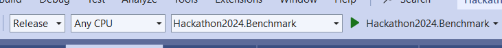
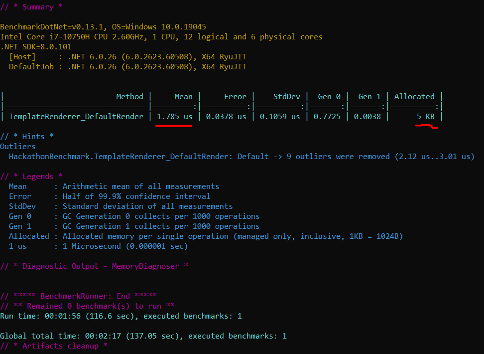

# Hackathon2024

Please checkout this branch locally:

```
git clone https://github.com/ThomasDevel/Hackathon2024.git
```

Open the Hackathon2024.sln solution in the Hackathon2024 folder to get started.

In this branch you will find 3 projects:

- Hackathon2024: This contains the implementation for rendering a HTML template according to the Engage Expression style.
- Hackathon2024.Tests: This contains the unit test to check if the final rendered HTML matches the desired output.
  The testing is done with xUnit.net. Learn more at https://xunit.net/
- Hackathon2024.Benchmark: This contains the BenchmarkDotNet code for tracking the performance of the implementation and it provides a reproducible measurement for your experiments. Learn more at https://github.com/dotnet/BenchmarkDotNet

Please make sure you are using Visual Studio 2019 which is necessary for the support of the .NET6.0 SDK.

## The goal of this Hackathon

To make our implementation of the TemplateRenderer.cs in Hackathon2024 as fast as possible!
We deliberately left a lot of room for improvements in the code and this represents a
perfect use case which could occur in a real life enterprise setting.

## HTML Templating Whut

Template engines are software that enable you to write HTML code with placeholders, variables, expressions, and logic. For example, you can use a template engine to loop through an array of data and display it in a table, or to conditionally render different elements based on user input. Template engines usually have their own syntax and rules, but they are compatible with standard HTML.

Template engines work by taking a template file, which is a HTML file with some special tags or syntax, and a data object with the values you want to insert into the template. The template engine then parses the template file, replaces the placeholders with the data, and generates a final HTML output that can be sent to the browser. For instance, the example below showcases what a moustache expression looks like and what the expected result should be:

> I really love memes. Especially {{meme_of_the_month}}, that one really cracks me up!

Should end up as:

> I really love memes. Especially Bobr Kurwa, that one really cracks me up!


Template engines offer several advantages for web development, such as separating the presentation layer from the data layer, reducing code duplication and boilerplate, and allowing for template reuse across different pages or components.

[This](./Hackathon2024/template.html) example template should finally be rendered as [this](./Hackathon2024/result_template.html).
Open both html files with your favorite browser to compare them visually.

## Benchmark Notes

Make sure you build the Hackathon2024.Benchmark in Release mode instead of Debug and
run it by pressing Ctrl+F5 so it does not attach a debugger. Do not worry if this takes a while to complete.



After the run you should be greeted by a similar overview as shown below where you can clearly see that we have
an average runtime of 1.785 µs and that our program allocated 5 KB of memory during its runtime.
Your job is to get that Mean as low as possible while also taking into account the Allocated memory as much as possible.



## But Most Of All

Have a good time, enjoy yourselves and try to learn a thing or two!


